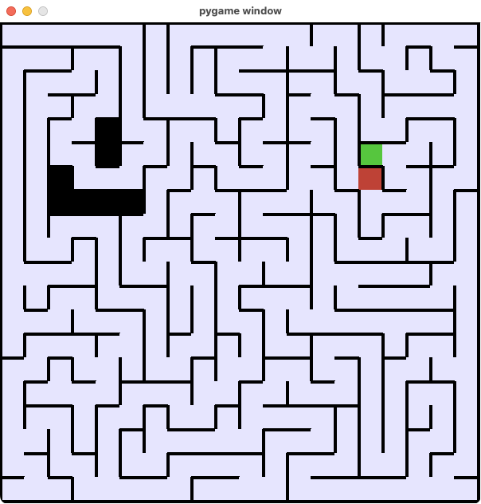

# Labyrinths

Uses pygame to paint a labyrinth it just created.
Tested on MacOS and Windows 10.

## Install

```bash
python3 -m venv venv
source venv/bin/activate
pip install --upgrade pip wheel
pip install -r requirements.txt
```

## Run

```bash
source venv/bin/activate
python demo.py
```

## Demo Screenshot


*Screenshot taken while the DepthFirst carver is busy.*
